<h1 align="center"><
   
  [Shop Tech (Ecommerce)](http://52.63.193.191:3001/docs/)
   
</h1>

---

 

  <h1 align="center">1. Auth</h1>
  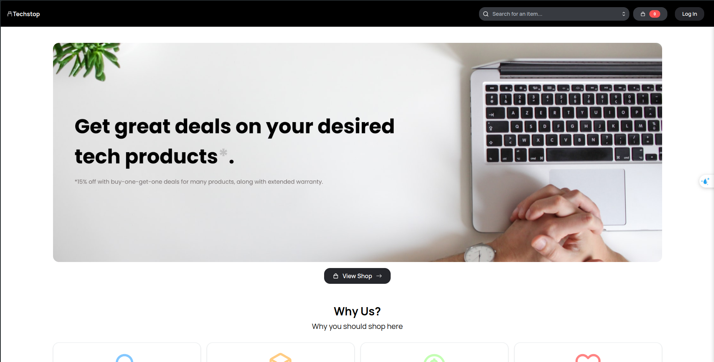
  
Image 1.1 Dashboard

   

  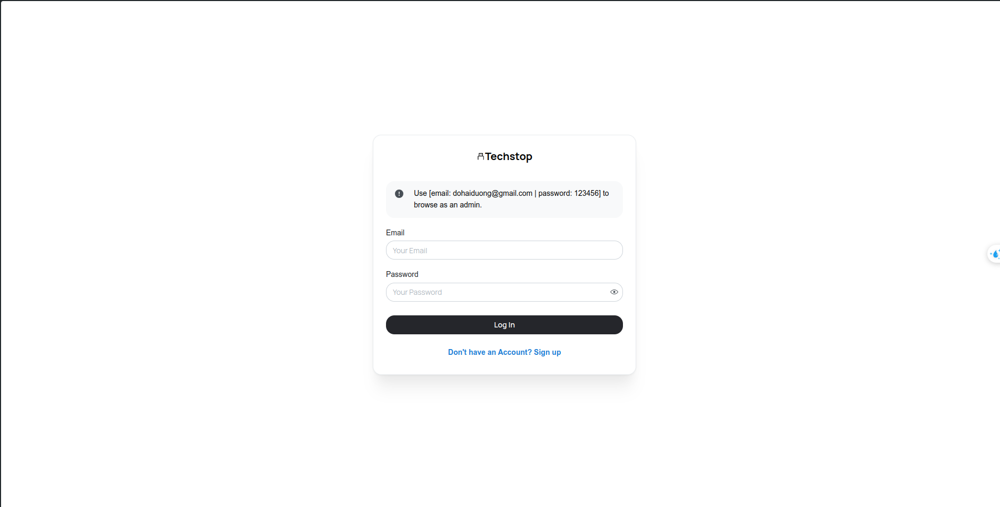
  
Image 1.2. Login

   

  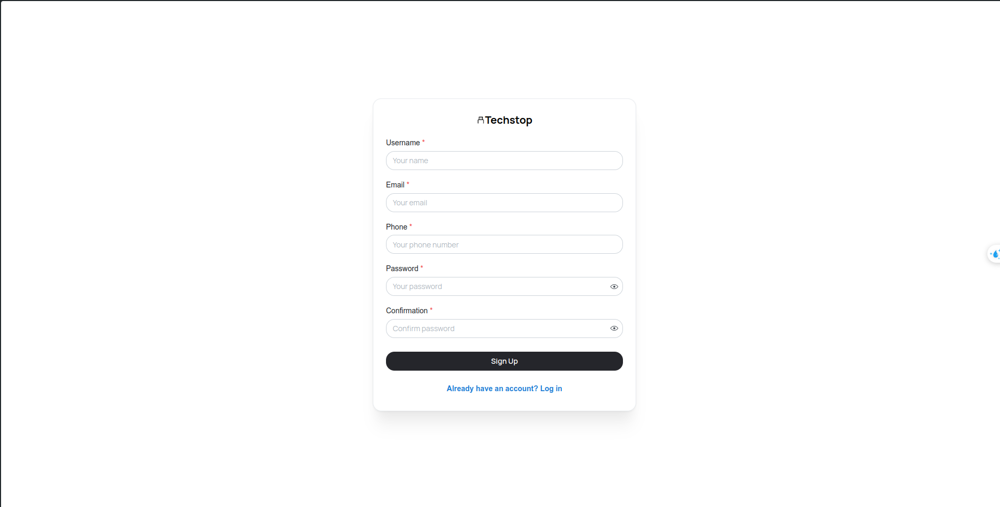
  
Image 1.3. Signup

   

  <h1 align="center">2. Products</h1>
  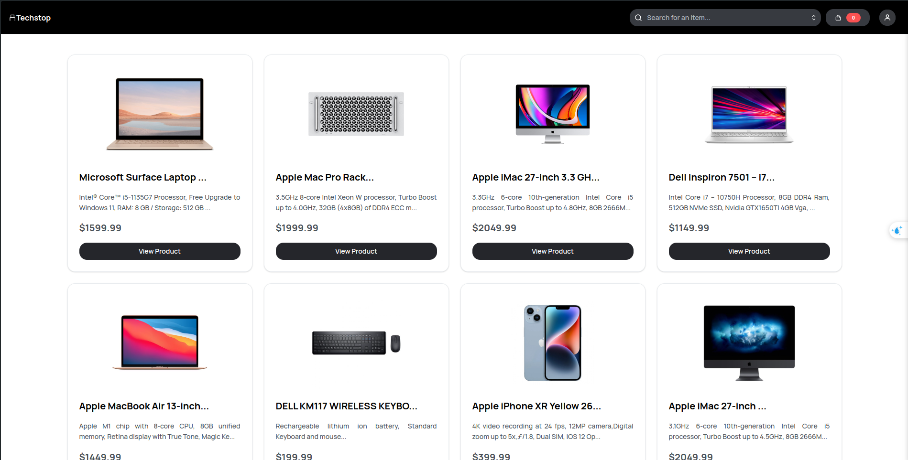
  
Image 2.1. List Product

   

  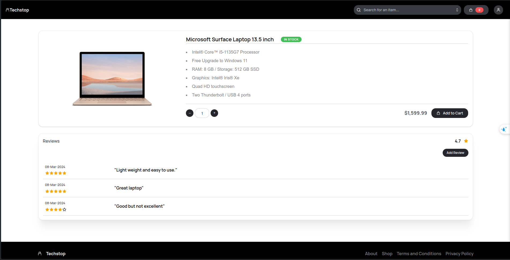
  
Image 2.2. Product Detail

   

  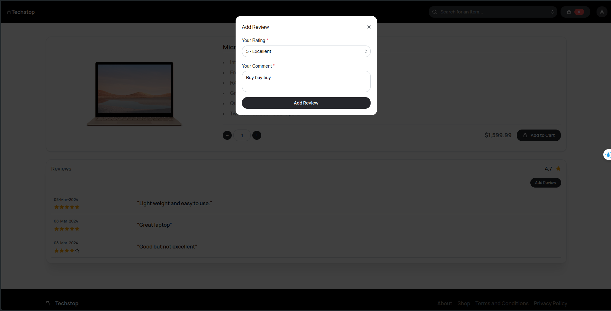
  
Image 2.3. Add Review

   

  <h1 align="center">3. User</h1>
  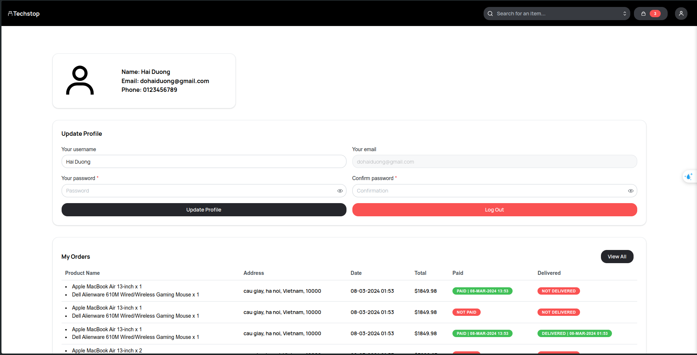
  
Image 3.1. Profile User

   

  <h1 align="center">4. Cart</h1>
   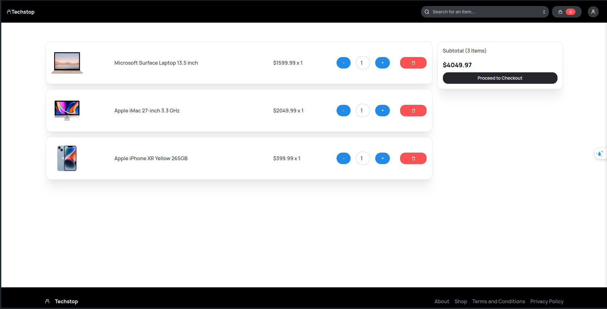
  
Image 4.1. Cart

   

  <h1 align="center">5. Order</h1>
   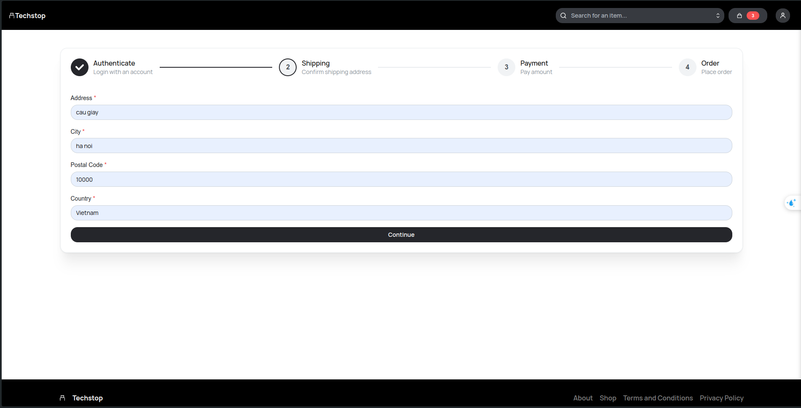
  
Image 5.1. Shipping

   

   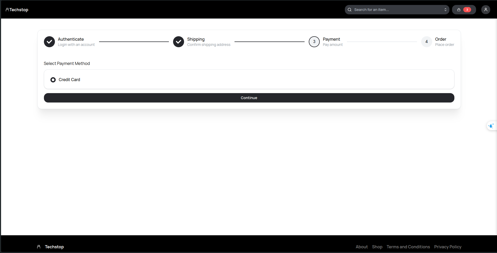
  
Image 5.2. Payment

   

   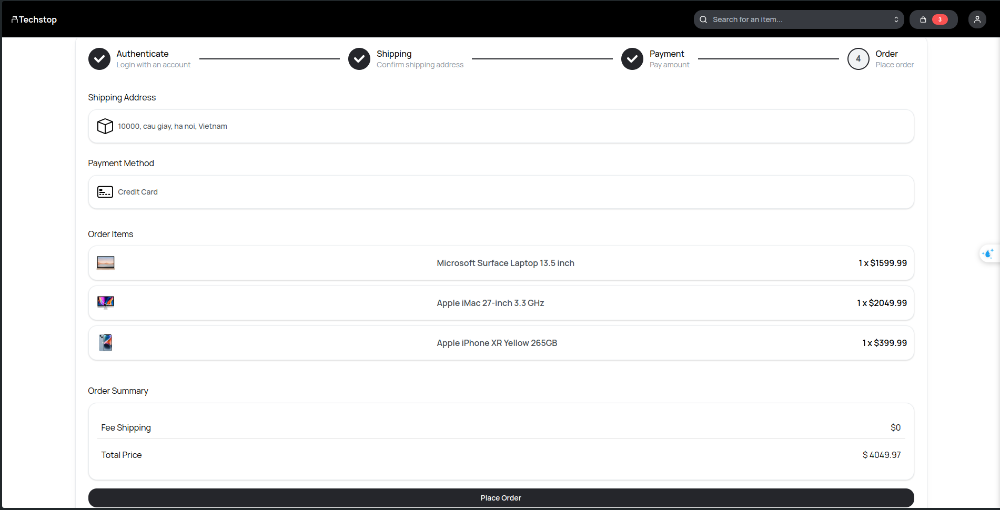
  
Image 5.3. Create Order

   

   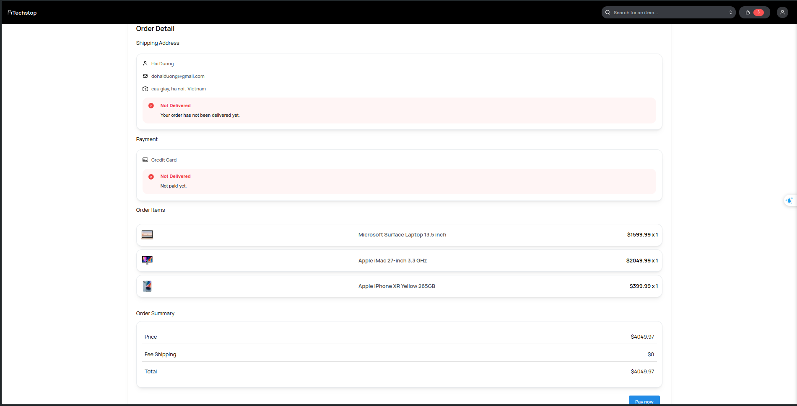
  
Image 5.4. Order Detail

   

   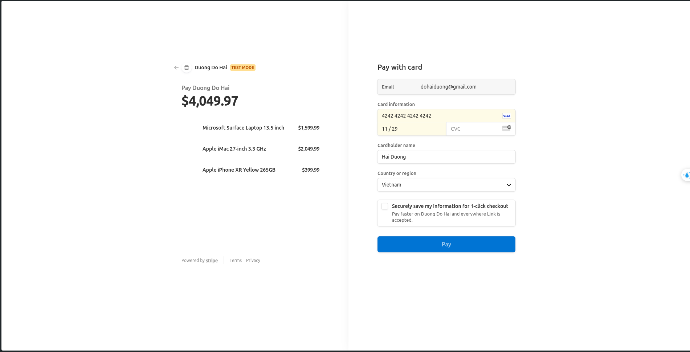
  
Image 5.5. Stripe payment

   

   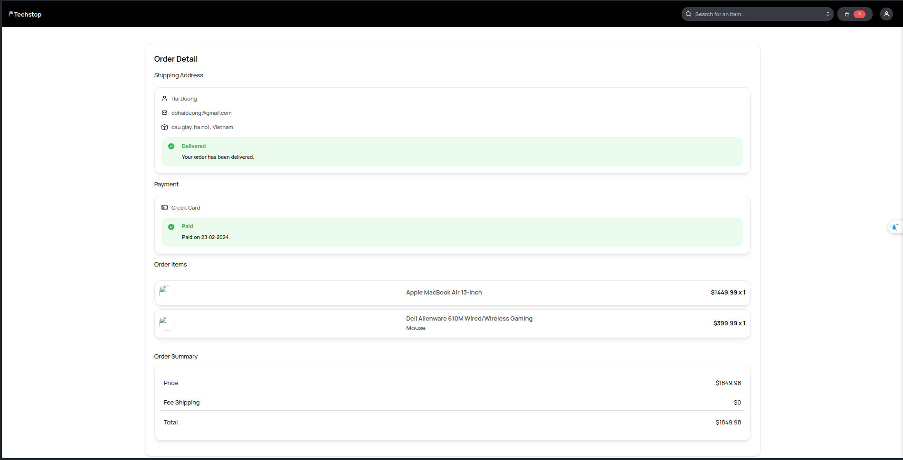
  
Image 5.6. Order Success

   

